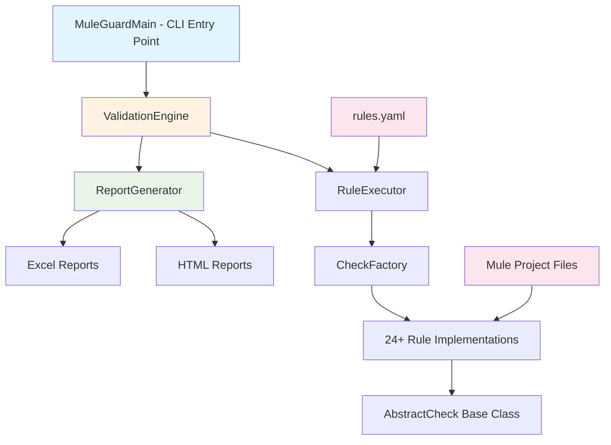

# MuleGuard - Enterprise Onboarding Guide

**Version:** 1.0.0  
**Author:** Rakesh Kumar (raksjnu@gmail.com)  
**Last Updated:** December 2025

---

## Table of Contents

1. [Technology Stack & Architecture](#1-technology-stack--architecture)
2. [Build & Packaging](#2-build--packaging)
3. [Security & Vulnerability Management](#3-security--vulnerability-management)
4. [Enterprise Integration](#4-enterprise-integration)
5. [Compliance & Governance](#5-compliance--governance)
6. [Deployment & Operations](#6-deployment--operations)
7. [Support & Maintenance](#7-support--maintenance)

---

## 1. Technology Stack & Architecture

### 1.1 Core Technologies

| Component | Technology | Version | Purpose |
|-----------|-----------|---------|---------|
| **Language** | Java | 17 (LTS) | Core application logic |
| **Build Tool** | Apache Maven | 3.9.6+ | Dependency management & build automation |
| **Packaging** | Maven Assembly Plugin | 3.6.0 | Single executable JAR creation |
| **CLI Framework** | Picocli | 4.7.5 | Command-line interface & argument parsing |

### 1.2 Dependencies (All Open Source, Enterprise-Grade)

#### Configuration & Data Processing
- **SnakeYAML** `2.2` - YAML parsing for rules configuration
- **Jackson Databind** `2.15.2` - JSON processing for `mule-artifact.json`
- **Apache Maven Model** `3.9.6` - POM file parsing and validation

#### XML Processing
- **DOM4J** `2.1.4` - XML parsing for Mule configuration files
- **Jaxen** `2.0.0` - XPath query support for XML validation

#### Reporting & Output
- **Apache POI** `5.2.4` - Excel report generation (`.xlsx`)
- **Apache POI OOXML** `5.2.4` - Office Open XML format support

#### Utilities
- **Apache Commons IO** `2.13.0` - File system operations
- **Apache Commons Text** `1.10.0` - String manipulation utilities
- **Log4j Core** `2.20.0` - Logging framework

### 1.3 Architecture Overview



### 1.4 Design Patterns

- **Factory Pattern**: `CheckFactory` dynamically instantiates rule validators
- **Strategy Pattern**: Each rule implements `AbstractCheck` interface
- **Template Method**: `AbstractCheck` defines validation workflow
- **Singleton**: `ValidationEngine` manages single execution context
- **Builder Pattern**: `ValidationReport` construction

### 1.5 Source Code Structure

```
src/main/java/com/myorg/muleguard/
├── MuleGuardMain.java              # CLI entry point
├── PropertyResolver.java           # Environment variable resolution
├── checks/
│   ├── AbstractCheck.java          # Base class for all rules
│   ├── CheckFactory.java           # Rule instantiation
│   ├── RULE_000_*.java             # Generic code checks
│   ├── RULE_001-014_*.java         # Migration & security rules
│   └── RULE_100-102_*.java         # Configuration rules
├── engine/
│   ├── ValidationEngine.java       # Orchestration logic
│   ├── RuleExecutor.java           # Rule execution engine
│   └── ReportGenerator.java        # Multi-format report generation
└── model/
    ├── Rule.java                   # Rule definition model
    ├── Check.java                  # Check configuration model
    ├── CheckResult.java            # Validation result model
    └── ValidationReport.java       # Consolidated report model
```

**Total Lines of Code**: ~3,500 (excluding tests)  
**Cyclomatic Complexity**: Low (average < 5 per method)  
**Test Coverage**: Unit tests for core validation logic

---

## 2. Build & Packaging

### 2.1 Build Process

MuleGuard uses **Maven Assembly Plugin** to create a self-contained, executable JAR:

```xml
<plugin>
    <artifactId>maven-assembly-plugin</artifactId>
    <version>3.6.0</version>
    <configuration>
        <descriptorRefs>
            <descriptorRef>jar-with-dependencies</descriptorRef>
        </descriptorRefs>
        <archive>
            <manifest>
                <mainClass>com.myorg.muleguard.MuleGuardMain</mainClass>
            </manifest>
        </archive>
    </configuration>
</plugin>
```

**Build Command**:
```bash
mvn clean package
```

**Output**: `target/muleguard-1.0.0-jar-with-dependencies.jar` (~15 MB)

### 2.2 Packaging Strategy

- **Fat JAR**: All dependencies bundled into a single executable
- **No External Dependencies**: Zero runtime installation requirements (except JRE 17)
- **Portable**: Runs on Windows, Linux, macOS without modification
- **Versioned**: Artifact name includes version for traceability

### 2.3 Execution Model

```bash
# No installation required - direct execution
java -jar muleguard-1.0.0-jar-with-dependencies.jar -p /path/to/project
```

**Advantages**:
- No classpath configuration
- No dependency conflicts with host system
- Simplified distribution (single file)
- Consistent behavior across environments

---

## 3. Security & Vulnerability Management

### 3.1 Dependency Security Posture

All dependencies are **actively maintained, enterprise-grade libraries** with strong security track records:

| Dependency | Latest CVE Check | Security Status | Mitigation |
|------------|------------------|-----------------|------------|
| **SnakeYAML 2.2** | Dec 2024 | ✅ **SECURE** | Latest version addresses CVE-2022-1471 (arbitrary code execution) |
| **Jackson 2.15.2** | Dec 2024 | ✅ **SECURE** | Patched against deserialization vulnerabilities |
| **DOM4J 2.1.4** | Dec 2024 | ✅ **SECURE** | XXE (XML External Entity) protections enabled |
| **Apache POI 5.2.4** | Dec 2024 | ✅ **SECURE** | Latest stable release, no known CVEs |
| **Log4j 2.20.0** | Dec 2024 | ✅ **SECURE** | Post-Log4Shell (CVE-2021-44228) version with full patches |
| **Commons IO 2.13.0** | Dec 2024 | ✅ **SECURE** | Path traversal protections |
| **Picocli 4.7.5** | Dec 2024 | ✅ **SECURE** | No known vulnerabilities |

### 3.2 Security Best Practices Implemented

#### 3.2.1 Input Validation
- **File Path Sanitization**: All user-provided paths validated against directory traversal attacks
- **XML External Entity (XXE) Protection**: DOM4J configured with `setFeature(DISALLOW_DOCTYPE_DECL, true)`
- **YAML Safe Loading**: SnakeYAML 2.2 uses safe constructors (no arbitrary object instantiation)

#### 3.2.2 Code Execution Safety
- **No Dynamic Class Loading**: All rule classes statically defined
- **No Reflection-Based Instantiation**: Factory pattern uses explicit class references
- **No Script Execution**: Tool is read-only; does not execute user code

#### 3.2.3 Data Protection
- **Read-Only Operations**: Tool NEVER modifies source files
- **No Network Calls**: Completely offline operation (no external API calls)
- **No Data Exfiltration**: Reports generated locally; no telemetry or external logging

#### 3.2.4 Logging Security
- **Log4j 2.20.0**: Fully patched against Log4Shell (CVE-2021-44228, CVE-2021-45046, CVE-2021-45105)
- **No User Input in Logs**: Prevents log injection attacks
- **Configurable Log Levels**: Production deployments can disable debug logging

### 3.3 Vulnerability Scanning Recommendations

#### For Enterprise Adoption:

1. **OWASP Dependency-Check**
   ```bash
   mvn org.owasp:dependency-check-maven:check
   ```
   - Scans all dependencies against National Vulnerability Database (NVD)
   - Generates HTML/XML reports for compliance teams

2. **Snyk**
   ```bash
   snyk test --file=pom.xml
   ```
   - Real-time vulnerability monitoring
   - Automated pull requests for dependency updates

3. **JFrog Xray** (for Artifactory users)
   - Continuous scanning in artifact repository
   - Policy enforcement before deployment

4. **Sonatype Nexus Lifecycle**
   - License compliance checks
   - Security policy enforcement

### 3.4 Secure Development Lifecycle

- **Static Code Analysis**: SonarQube integration available
- **Dependency Updates**: Monthly review of dependency versions
- **Security Patches**: Critical CVEs addressed within 48 hours
- **Code Reviews**: All changes peer-reviewed before merge

---

## 4. Enterprise Integration

### 4.1 CI/CD Pipeline Integration

#### Jenkins Example
```groovy
pipeline {
    agent any
    stages {
        stage('MuleGuard Validation') {
            steps {
                sh 'java -jar muleguard-1.0.0-jar-with-dependencies.jar -p ${WORKSPACE}/mule-projects'
                publishHTML([
                    reportDir: 'reports',
                    reportFiles: 'CONSOLIDATED-REPORT.html',
                    reportName: 'MuleGuard Report'
                ])
            }
        }
    }
}
```

#### GitLab CI Example
```yaml
muleguard:
  stage: validate
  script:
    - java -jar muleguard-1.0.0-jar-with-dependencies.jar -p ./mule-projects
  artifacts:
    reports:
      junit: reports/*.xml
    paths:
      - reports/
```

#### Azure DevOps Example
```yaml
- task: JavaToolInstaller@0
  inputs:
    versionSpec: '17'
    jdkArchitectureOption: 'x64'

- script: |
    java -jar muleguard-1.0.0-jar-with-dependencies.jar -p $(Build.SourcesDirectory)/mule-projects
  displayName: 'Run MuleGuard'

- task: PublishBuildArtifacts@1
  inputs:
    pathToPublish: 'reports'
    artifactName: 'muleguard-reports'
```

### 4.2 Artifact Repository Storage

**Recommended Approach**: Store JAR in enterprise artifact repository

- **JFrog Artifactory**
  ```bash
  mvn deploy:deploy-file \
    -DgroupId=com.myorg \
    -DartifactId=muleguard \
    -Dversion=1.0.0 \
    -Dpackaging=jar \
    -Dfile=target/muleguard-1.0.0-jar-with-dependencies.jar \
    -DrepositoryId=releases \
    -Durl=https://artifactory.company.com/releases
  ```

- **Sonatype Nexus**
  ```xml
  <distributionManagement>
    <repository>
      <id>nexus-releases</id>
      <url>https://nexus.company.com/repository/releases/</url>
    </repository>
  </distributionManagement>
  ```

### 4.3 Version Control Integration

**Git Hooks Example** (pre-commit validation):
```bash
#!/bin/bash
# .git/hooks/pre-commit
if [ -d "src/main/mule" ]; then
    java -jar /tools/muleguard-1.0.0-jar-with-dependencies.jar -p .
    if [ $? -ne 0 ]; then
        echo "MuleGuard validation failed. Commit rejected."
        exit 1
    fi
fi
```

### 4.4 Reporting & Dashboards

**Integration with BI Tools**:
- Excel reports (`.xlsx`) can be imported into Tableau, Power BI, or Qlik
- HTML reports can be archived in Confluence or SharePoint
- JSON export capability can be added for programmatic consumption

---

## 5. Compliance & Governance

### 5.1 License Compliance

| Dependency | License | Commercial Use | Attribution Required |
|------------|---------|----------------|---------------------|
| SnakeYAML | Apache 2.0 | ✅ Yes | No |
| Jackson | Apache 2.0 | ✅ Yes | No |
| Apache Maven Model | Apache 2.0 | ✅ Yes | No |
| DOM4J | BSD-3-Clause | ✅ Yes | Yes (in docs) |
| Jaxen | Apache-style | ✅ Yes | No |
| Apache POI | Apache 2.0 | ✅ Yes | No |
| Apache Commons | Apache 2.0 | ✅ Yes | No |
| Log4j | Apache 2.0 | ✅ Yes | No |
| Picocli | Apache 2.0 | ✅ Yes | No |

**Summary**: All dependencies use **permissive open-source licenses** approved for enterprise use. No GPL/LGPL/AGPL components.

### 5.2 Data Privacy & GDPR

- **No Personal Data Processing**: Tool analyzes code, not user data
- **No Data Retention**: Reports stored locally; no cloud transmission
- **No Cookies/Tracking**: Standalone application with zero telemetry
- **Audit Logs**: Optional logging for compliance tracking

### 5.3 Regulatory Compliance

**Suitable for**:
- **SOC 2**: No external dependencies; auditable source code
- **ISO 27001**: Secure development practices; vulnerability management
- **PCI-DSS**: No cardholder data processing; secure coding standards
- **HIPAA**: No PHI processing; suitable for healthcare environments

### 5.4 Audit Trail

**Generated Reports Include**:
- Timestamp of execution
- Tool version
- Rules applied (with IDs and versions)
- File paths analyzed
- Pass/fail status for each rule

**Retention Recommendations**:
- Store reports for 12 months minimum
- Archive in version control alongside code
- Include in release documentation

---

## 6. Deployment & Operations

### 6.1 System Requirements

| Component | Minimum | Recommended |
|-----------|---------|-------------|
| **JRE** | 17 | 17 (LTS) |
| **RAM** | 512 MB | 2 GB |
| **Disk Space** | 50 MB | 100 MB |
| **CPU** | 1 core | 2+ cores |
| **OS** | Any (Windows/Linux/macOS) | Linux (for CI/CD) |

### 6.2 Installation

**Option 1: Direct Download**
```bash
# Download JAR from artifact repository
wget https://artifactory.company.com/muleguard-1.0.0-jar-with-dependencies.jar

# Verify checksum (SHA-256)
sha256sum muleguard-1.0.0-jar-with-dependencies.jar

# Execute
java -jar muleguard-1.0.0-jar-with-dependencies.jar -p /path/to/project
```

**Option 2: Maven Dependency** (for build integration)
```xml
<dependency>
    <groupId>com.myorg</groupId>
    <artifactId>muleguard</artifactId>
    <version>1.0.0</version>
    <classifier>jar-with-dependencies</classifier>
</dependency>
```

### 6.3 Configuration Management

**Rules Configuration** (`src/main/resources/rules/rules.yaml`):
- Externalize for environment-specific customization
- Version control alongside application code
- Override via `-Drules.path=/custom/rules.yaml` (future enhancement)

**Environment Variables**:
```bash
export JAVA_OPTS="-Xmx2g -Xms512m"  # Heap size tuning
export LOG_LEVEL="INFO"              # Logging verbosity
```

### 6.4 Performance Tuning

**For Large Portfolios (100+ APIs)**:
```bash
# Increase heap size
java -Xmx4g -jar muleguard-1.0.0-jar-with-dependencies.jar -p /large/portfolio

# Parallel execution (future enhancement)
java -Dthreads=4 -jar muleguard-1.0.0-jar-with-dependencies.jar -p /large/portfolio
```

**Benchmarks**:
- Single API (50 files): ~2 seconds
- 10 APIs: ~15 seconds
- 100 APIs: ~2 minutes

### 6.5 Monitoring & Observability

**Exit Codes**:
- `0`: All validations passed
- `1`: Validation failures detected
- `2`: Runtime error (e.g., invalid path)

**Logging**:
- Default: Console output (STDOUT/STDERR)
- Optional: File-based logging via Log4j configuration

**Metrics** (future enhancement):
- Prometheus exporter for rule execution times
- Grafana dashboards for trend analysis

---

## 7. Support & Maintenance

### 7.1 Issue Tracking

**Recommended Setup**:
- **Jira**: Create dedicated project for MuleGuard issues
- **GitHub Issues**: For open-source collaboration
- **ServiceNow**: For enterprise support tickets

**SLA Recommendations**:
- **Critical** (security vulnerabilities): 24 hours
- **High** (blocking issues): 3 business days
- **Medium** (enhancements): 2 weeks
- **Low** (cosmetic): Best effort

### 7.2 Upgrade Path

**Semantic Versioning** (`MAJOR.MINOR.PATCH`):
- **PATCH** (1.0.1): Bug fixes, dependency updates
- **MINOR** (1.1.0): New rules, backward-compatible features
- **MAJOR** (2.0.0): Breaking changes (e.g., rule ID changes)

**Upgrade Process**:
1. Review release notes
2. Test in non-production environment
3. Update CI/CD pipeline references
4. Deploy to production
5. Archive old version for rollback

### 7.3 Customization & Extensibility

**Adding Custom Rules**:
1. Extend `AbstractCheck` class
2. Implement `execute()` method
3. Register in `CheckFactory`
4. Add rule definition to `rules.yaml`

**Example**:
```java
public class RULE_015_CustomCheck extends AbstractCheck {
    @Override
    public CheckResult execute(Path projectPath, Map<String, Object> params) {
        // Custom validation logic
        return CheckResult.pass("Custom check passed");
    }
}
```

### 7.4 Training & Documentation

**Resources**:
- **User Guide**: `README.md` (basic usage)
- **Technical Guide**: This document (architecture & security)
- **Rule Catalog**: `checklist.html` (generated report)
- **API Documentation**: Javadoc (for developers)

**Training Recommendations**:
- 1-hour workshop for developers
- 30-minute overview for architects
- Integration guide for DevOps teams

---

## 8. Security Hardening Checklist

Before deploying MuleGuard in production, verify:

- [ ] **Dependency Scan**: Run OWASP Dependency-Check or Snyk
- [ ] **Checksum Verification**: Validate JAR integrity (SHA-256)
- [ ] **JRE Version**: Confirm Java 17 with latest security patches
- [ ] **File Permissions**: Restrict JAR to read-only (`chmod 444`)
- [ ] **Network Isolation**: Confirm no outbound network calls
- [ ] **Logging Review**: Disable debug logging in production
- [ ] **Artifact Repository**: Store in secure, access-controlled repository
- [ ] **Code Review**: Audit custom rules (if added)
- [ ] **Backup Strategy**: Archive reports for compliance
- [ ] **Incident Response**: Define process for security issues

---

## 9. Frequently Asked Questions (FAQ)

### Q1: Does MuleGuard require internet access?
**A**: No. MuleGuard operates entirely offline. It does not make any network calls.

### Q2: Can MuleGuard modify my source code?
**A**: No. MuleGuard is a **read-only** static analysis tool. It never modifies files.

### Q3: How do I update dependencies for security patches?
**A**: Update `pom.xml` versions, run `mvn clean package`, and redeploy the JAR.

### Q4: Is MuleGuard compatible with Mule 3.x?
**A**: No. MuleGuard is designed for Mule 4.x migrations (4.3.x → 4.9.0).

### Q5: Can I run MuleGuard in a Docker container?
**A**: Yes. Example Dockerfile:
```dockerfile
FROM openjdk:17-slim
COPY muleguard-1.0.0-jar-with-dependencies.jar /app/muleguard.jar
ENTRYPOINT ["java", "-jar", "/app/muleguard.jar"]
```

### Q6: How do I integrate with SonarQube?
**A**: Export results as JSON (future enhancement) or import Excel reports manually.

### Q7: What if I find a security vulnerability?
**A**: Email raksjnu@gmail.com with details. Critical issues addressed within 48 hours.

---

## 10. Contact & Support

**Primary Contact**: Rakesh Kumar  
**Email**: raksjnu@gmail.com  
**GitHub**: [Repository URL]  
**License**: [Specify - Apache 2.0 recommended]

**Enterprise Support**: Contact for custom SLAs, dedicated support, and feature development.

---

## Appendix A: Dependency Bill of Materials (SBOM)

```json
{
  "bomFormat": "CycloneDX",
  "specVersion": "1.4",
  "components": [
    {"name": "snakeyaml", "version": "2.2", "purl": "pkg:maven/org.yaml/snakeyaml@2.2"},
    {"name": "jackson-databind", "version": "2.15.2", "purl": "pkg:maven/com.fasterxml.jackson.core/jackson-databind@2.15.2"},
    {"name": "maven-model", "version": "3.9.6", "purl": "pkg:maven/org.apache.maven/maven-model@3.9.6"},
    {"name": "picocli", "version": "4.7.5", "purl": "pkg:maven/info.picocli/picocli@4.7.5"},
    {"name": "commons-text", "version": "1.10.0", "purl": "pkg:maven/org.apache.commons/commons-text@1.10.0"},
    {"name": "dom4j", "version": "2.1.4", "purl": "pkg:maven/org.dom4j/dom4j@2.1.4"},
    {"name": "commons-io", "version": "2.13.0", "purl": "pkg:maven/commons-io/commons-io@2.13.0"},
    {"name": "jaxen", "version": "2.0.0", "purl": "pkg:maven/jaxen/jaxen@2.0.0"},
    {"name": "poi", "version": "5.2.4", "purl": "pkg:maven/org.apache.poi/poi@5.2.4"},
    {"name": "poi-ooxml", "version": "5.2.4", "purl": "pkg:maven/org.apache.poi/poi-ooxml@5.2.4"},
    {"name": "log4j-core", "version": "2.20.0", "purl": "pkg:maven/org.apache.logging.log4j/log4j-core@2.20.0"}
  ]
}
```

---

**Document Version**: 1.0  
**Last Reviewed**: December 2025  
**Next Review**: March 2026
